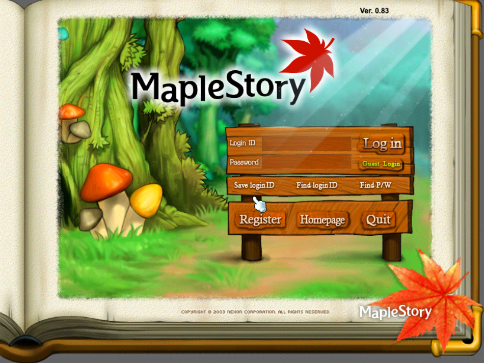
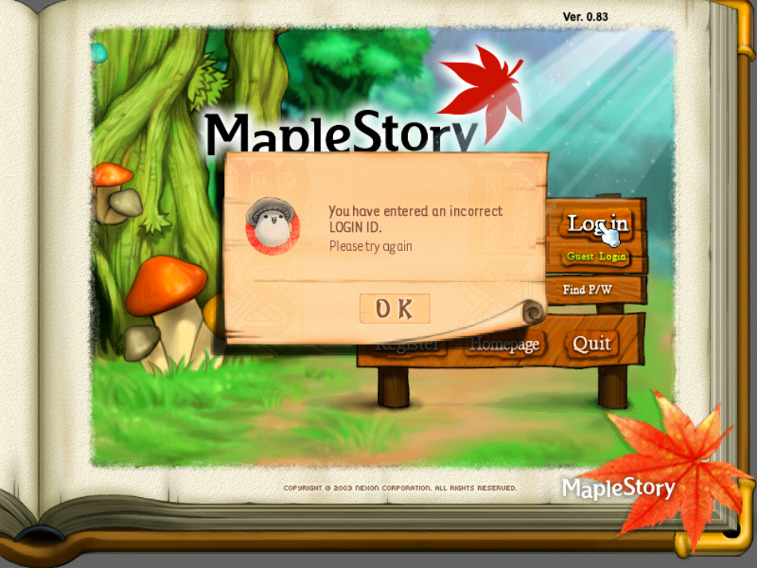
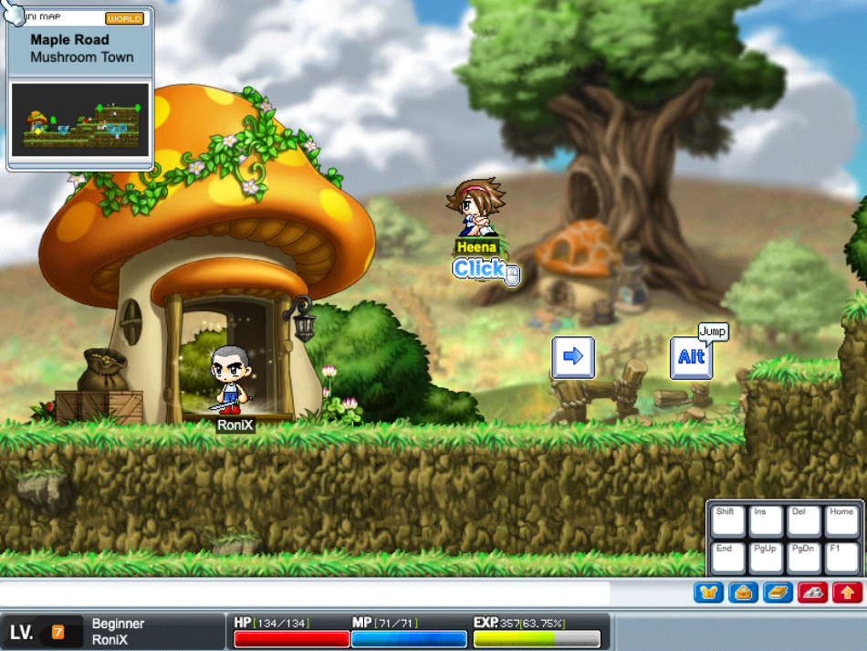

# MapleOrigin

A 1:1 recreation of pre-Big Bang **MapleStory v83** running entirely in the browser.  
TypeScript + HTML5 Canvas client, Node.js WebSocket server, everything rendered from original WZ game assets.

> **Legal notice:** This is an unofficial fan project for research and educational purposes. It is not affiliated with, endorsed, sponsored, or approved by Nexon. "MapleStory" is a trademark of Nexon and is used here only to describe what this project recreates. **No game assets are included or distributed** — all MapleStory graphics, audio, and game data are the property of Nexon, and you must supply your own legally obtained copy of the v83 game files to run this project. If you are a rights holder with a concern, please open an issue on this repository and it will be addressed promptly.

---

## Screenshots





---

## Quick Start

### Prerequisites
- Node.js v14+
- v83 `.wz` game files (not included)

### 1. Convert WZ Data

```bash
cd tools/wz-parser && npm install && npx coffee -c parser/*.coffee && cd ../..
node tools/wz-to-json.js 83/UI.wz TypeScript-Client/public/wz_client/UI.wz/
# Repeat for all 17 .wz files (Map, String, Quest, Character, Mob, Npc, etc.)
```

### 2. Install & Run

```bash
# Terminal 1 — Server
npm install && npm run dev          # WebSocket + SQLite on :3001

# Terminal 2 — Client
cd TypeScript-Client && npm install && npm run dev   # Vite dev server on :3000
```

Login: `admin` / `admin`

> ⚠️ The default credentials are for **local development only**. If you expose the
> server beyond localhost, change the admin password first (registration is disabled;
> accounts are managed directly in the SQLite database).

### 3. Production Build

```bash
cd TypeScript-Client && npm run build && cd ..
npm start                           # Serves client + server on :3001
```

---

## Controls

| Key | Action | Key | Action |
|-----|--------|-----|--------|
| Arrows | Move | I | Inventory |
| Alt | Jump | E | Equipment |
| Ctrl | Attack | S | Stats |
| Z | Pick up | Q | Quest Log |
| Enter | Chat | K | Skills |
| M | Minimap | Esc | Close menus |
| W | World Map | P | Party |
| Alt+Enter | Fullscreen | F9 | Debug drag |

---

## Features

### Core Engine
- Authentic 800x600 v83 resolution with fullscreen CSS scaling (4:3 letterboxing, single resample)
- 60 FPS game loop with camera easing and integer-snapped rendering
- Physics: gravity, walking, jumping, climbing, knockback, fall damage
- Lazy asset loading with parallelized map fetches and automatic eviction of map-specific data on map change

### Login & Characters
- Authentic v83 login screen with world/channel select
- 3-stage character creation: race select, name validation, appearance customization
- SQLite persistence: stats, inventory, equipment, quests, map position
- Auto-save on map change, disconnect, every 30s, and browser close

### Combat
- 16 weapon types with correct stances, ranges, and sound effects
- v83 damage formulas: per-weapon stat scaling, defense, accuracy/evasion
- Projectile system for bows, crossbows, claws, and pistols
- Monster AI with patrol, HP bars, damage numbers, death animations

### Maps & World
- Full map rendering: backgrounds, tiles, objects, footholds, portals
- Fade transitions, taxi system, minimap with player/NPC/portal icons
- Background music from Sound.wz
- Reactors: breakable objects, multi-state animations, item drops

### NPCs & Quests
- 708 NPC scripts + 253 quest scripts + 458 portal scripts running client-side via `new Function()`
- Portal script engine for scripted portals (quest-gated areas, training centers, dungeons)
- 2,824 quests from Quest.wz with mob kill tracking and item requirements
- Quest log UI with Available/In Progress/Complete tabs, mob/item progress display
- NPC indicators, GMS-style quest listings, inline format codes (`#m` map names, `#t` item names)
- Job advancement NPCs with stat requirement checks

### Inventory & Equipment
- 5-tab inventory (Equip, Use, Setup, Etc, Cash)
- Equipment window with 16+ slots — equip/unequip via double-click, drag out to unequip or drop
- GMS-style equip tooltips: REQ stats, job class bar, category, scroll bonuses, remaining upgrade slots
- Item consumption (potions/food), NPC shops, drop dialogs, drag ghost icons
- Ground drops for all item types (including equips, with scroll data preserved through drop/pickup)
- Quest item protection

### Skills
- Skill window (K) with SP allocation, skill hotkey bar with drag-and-drop assignment
- Attack skills with WZ ball projectiles (Three Snails consumes tier-matched shells, v83 fixed damage), buffs, and skill sounds/effects

### Cash Shop
- Full-screen v83 Cash Shop from the SHOP button: 9 category tabs, item grid with pagination, Best Items rail (server-tallied top sellers), purchase confirm flow
- NX currency persisted end-to-end (free +10,000 per Charge click)
- Playable character preview: walk, jump, climb, and attack inside the preview stage with 1:1 game physics; try-on tray for cash clothes
- Cash equips wear as costume covers over real gear (stats untouched), authentic Period-based rentals with expiry countdown and removal at login
- Avatar megaphones (your character rides the banner), face-expression coupons

### Pets
- Buy live pets in the Cash Shop PET tab — up to 3 out at once in a follow train
- Real-physics follow AI: walks footholds, hops ledges, rides your back while climbing, teleports with the warp effect when left behind
- Feeding and fullness decay, closeness leveling to 30 with the authentic closeness table, level-up effect
- Chat commands from PetDialog.wz ("sit", "iloveyou", ...) with success/fail reactions in real pet chat balloons and WZ name tags
- Pet equipment panel in the Equipment window (PET EQUIP): cosmetic ribbons/hats rendered on the pet, Item Pouch / Meso Magnet auto-loot, Auto HP/MP potion pouches
- Evolution (Baby Dragon/Robo lines with the Rock of Evolution), egg hatching, 90-day pet life ending as a doll
- Pets persist across relogs/maps and are visible to other players (zero-bandwidth movement sync — remotes simulate the follow AI locally)

### Multiplayer
- Real-time WebSocket sync: position, stance, animation, equipment, pets
- Host-client mob AI with automatic failover
- Shared item drops/pickups, reactor sync, chat balloons, level-up effects
- Party system with invite/leave, HP-bar member list, and shared kill EXP
- Death system with tombstone animation and town respawn

---

## Architecture

```
maple-origin/
├── TypeScript-Client/src/     # Browser client (~80 TypeScript files)
│   ├── GameCanvas.ts          # Canvas rendering engine
│   ├── MapleCharacter.ts      # Character sprite composition
│   ├── MapleMap.ts            # Map loading and rendering
│   ├── Monster.ts             # Enemy AI, HP, drops
│   ├── NPC.ts                 # NPC rendering and dialogue
│   ├── mysocket.ts            # WebSocket client
│   ├── Physics.ts             # Movement and collision
│   ├── Quest/                 # Quest data, manager, script engine
│   ├── UI/                    # All UI from WZ assets
│   └── wz-utils/              # WZ JSON parsing
├── server/                    # Backend modules
│   ├── db.js                  # SQLite (WAL mode)
│   ├── models/                # User + Character CRUD
│   └── handlers/              # Auth, player, mob, item, chat
├── server.js                  # WebSocket server entry point
└── tools/                     # WZ converter, parser, explorer
    └── cosmic-db-data/        # Cosmic DB seed SQL (shops, drops) kept for conversion
```

**Design principle:** Everything is rendered from WZ sprite data. No custom HTML/CSS UI, no canvas-drawn rectangles for panels.

---

## Server Port Roadmap

Porting [Cosmic](https://github.com/P0nk/Cosmic) (Java v83 emulator) to TypeScript:

| Phase | Status | Scope |
|-------|--------|-------|
| **1** | Done | WebSocket protocol, SQLite, auth, character CRUD, persistence, auto-save |
| **2** | Next | Server-authoritative movement, monster AI, damage validation, drops |
| **3** | Planned | Skills, job advancement, quests, parties, guilds, trading |
| **4** | Future | Boss fights, party quests, cash shop, FM, events, GM commands |

---

## Known Issues & TODO

See [CHANGELOG.md](CHANGELOG.md) for recent fixes. Major remaining work:

- **Quest reward selection**: Quests with "choose one" rewards (e.g., quiz chain final reward: Blue Potion x30 OR Stolen Fence) don't present a choice UI yet
- **Quiz quests**: `#L` selection codes in Say.img dialogue (530 quests) need full parse+render as clickable options with per-selection responses
- **Job trial system**: Maple Island job instructors (Dances with Balrog, Athena Pierce, Grendel, etc.) offer job trial quests (1048-1053) that temporarily change job, teach trial skills, and warp to trial maps — requires temporary job change + trial map instances
- **Skill coverage**: skill window, hotkey bar, and beginner/attack/buff skills work; full per-job skill coverage (mob skills, summons, party buffs) still in progress
- **Quest system**: Fame reward bug (104 quests), item start requirements (488 quests)
- **Scripts**: ~23 PQ/event NPC scripts remain non-functional pending the party/event-instance system (they run inside event maps that are unreachable without it); all other NPC, quest, and portal scripts execute crash-free via Java shims and chainable API stubs
- **Missing features**: passive HP/MP regen, Cash Shop gifting/wishlist/packages, pet revival (Water of Life)

---

## Contributing

See [CONTRIBUTING.md](CONTRIBUTING.md). The short version: contributions are welcome, but **pull requests must never include game assets** (WZ data, sprites, audio) — this project ships none and that's what keeps it publishable.

## License

This project is licensed under the **GNU Affero General Public License v3.0** — see [LICENSE](LICENSE).

The NPC, quest, and portal scripts (`TypeScript-Client/public/scripts/`) and the DB seed data (`tools/cosmic-db-data/`, drop tables) originate from the [OdinMS](https://odinms.de) lineage of open-source server emulators ([HeavenMS](https://github.com/ronancpl/HeavenMS), [Cosmic](https://github.com/P0nk/Cosmic)) and are distributed under the same AGPL-3.0 terms, with their original copyright headers preserved:

> Copyright (C) 2008 Patrick Huy, Matthias Butz, Jan Christian Meyer

## Credits

- Fork of [MapleWeb](https://github.com/Jeck-Sparrow-5/MapleWeb)
- Server logic, scripts, and game data reference: [Cosmic](https://github.com/P0nk/Cosmic) by P0nk, descended from [HeavenMS](https://github.com/ronancpl/HeavenMS) and OdinMS
- WZ file parsing: [MapleStory-node-resources](https://github.com/PhilippSchwab/MapleStory-node-resources) by Philipp Schwab, GPL-3.0 (`tools/wz-parser/`, cloned separately — not distributed with this repo)
- MapleStory is © Nexon. All game assets belong to Nexon.
